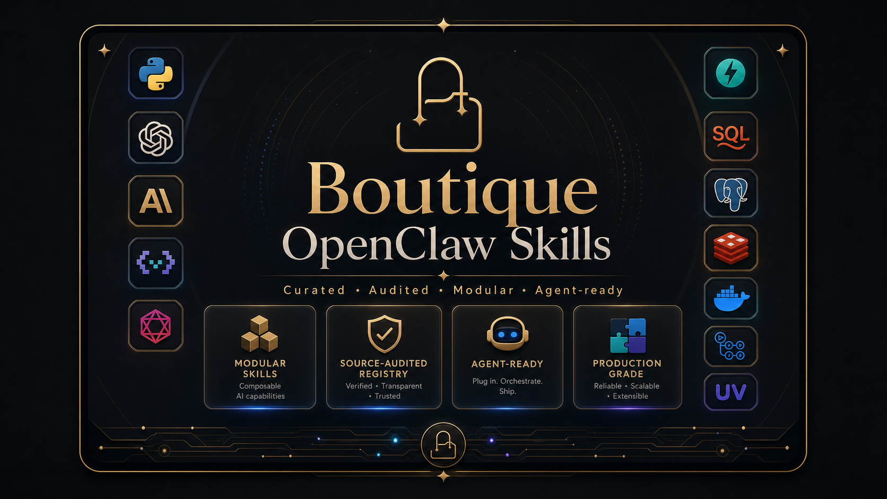

<div align="center">


# Boutique OpenClaw Skills

**Curated skills for capable OpenClaw, Open, and Hermes agents.**

**面向智能体的精品技能仓库：原生来源可审计、能力不重复、安装可控、持续月评。**

[](#boutique-openclaw-skills)
[](#all-skills)
[](docs/UPDATE_AND_AUDIT.md)
[](catalog/standard-bundle.json)
[](docs/generated/scoring-model.md)
[](LICENSE)

<p align="center">
  
</p>
<p align="center">
  
  
  
  
  
</p>



</div>

## 中文说明

Boutique OpenClaw Skills 是一个面向 AI Agent 的精品技能合集。仓库把默认技能、标准配置组、横向分级、纵向分类、API Key/工具依赖、风险等级、冲突组和原生上游来源统一整理成可审计的注册表，目标是让用户安装后即获得一套少重复、低噪声、生产可用的能力组合。

本仓库强调三件事：一是每个活跃 skill 都必须能追溯到 GitHub、ClawHub/CL.Up、skills.h 或官方项目站点；二是同一能力只推荐一个最佳 skill，避免 Web Search、PDF、Email、Finance Data 等能力重复安装；三是每月自动重建索引和审计报告，让 README、JSON Catalog 与安装包保持一致。

## Overview

Boutique OpenClaw Skills is a source-audited skill registry for building capable OpenClaw, Open, and Hermes agents without duplicate tools or noisy installs. It keeps a full machine-readable catalog, a recommended no-duplicate bundle, generated indexes, and monthly audit automation in one place.

## Quick Start

Install the recommended no-duplicate bundle:

```bash
./scripts/install-standard-bundle.sh --dry-run
./scripts/install-standard-bundle.sh
```

Or install a tier:

```bash
./scripts/install-tier.sh low
./scripts/install-tier.sh medium
./scripts/install-tier.sh high
```

Or install a grouped suite:

```bash
./scripts/install-suite.sh llmquant --dry-run
./scripts/install-suite.sh llmquant
```

## At A Glance

| Metric | Value |
|---|---:|
| Curated skills | 282 |
| Skill suites | 3 |
| Native sources verified or referenced | 276 |
| Agent preset exclusions | 6 |
| Missing native origins | 0 |
| Standard bundle size | 31 skills + 1 pack |

## Standard Bundle

The standard bundle keeps one best skill per capability and excludes skills already built into Open or Hermes.

`a-stock-data` is included in the general standard bundle as the default A-share data skill. Use `./scripts/install-suite.sh finance-investment-standard --dry-run` or the finance profile when an investment workflow needs the full domain stack.

| Type | Capability | Skill / Pack | Stars | Use |
|---|---|---|---:|---|
| `skill` | `agent-method` | `brainstorming` | 5★ | `direct` |
| `skill` | `skill-discovery` | `find-skills` | 5★ | `direct` |
| `skill` | `web-search` | `multi-search-engine` | 5★ | `direct` |
| `skill` | `url-extraction` | `url-to-markdown` | 4★ | `browser-required` |
| `skill` | `browser-automation` | `agent-browser` | 4★ | `browser-required` |
| `skill` | `code-hosting` | `github` | 4★ | `api-key` |
| `skill` | `task-tracking` | `task` | 5★ | `direct` |
| `skill` | `planning` | `planning-with-files` | 5★ | `direct` |
| `skill` | `verification` | `verification-before-completion` | 5★ | `direct` |
| `skill` | `skill-authoring` | `skill-creator` | 5★ | `direct` |
| `skill` | `security-review` | `skill-security-auditor` | 5★ | `direct` |
| `skill` | `data-analysis` | `data-analyst` | 5★ | `direct` |
| `skill` | `docs` | `minimax-docx` | 3★ | `api-key` |
| `skill` | `spreadsheet` | `minimax-xlsx` | 3★ | `api-key` |
| `skill` | `slides` | `pptx-generator` | 4★ | `direct` |
| `skill` | `pdf` | `nano-pdf` | 5★ | `direct` |
| `skill` | `frontend` | `generative-ui` | 5★ | `direct` |
| `skill` | `fullstack` | `fullstack-dev` | 3★ | `api-key` |
| `skill` | `mcp` | `mcp-builder` | 4★ | `mcp-required` |
| `skill` | `media-download` | `media-downloader` | 3★ | `api-key` |
| `skill` | `image-generation` | `gemini-image-service` | 3★ | `api-key` |
| `skill` | `research-news` | `news-radar` | 4★ | `mcp-required` |
| `skill` | `html-publishing` | `html-anything` | 5★ | `browser-required` |
| `skill` | `finance-data` | `a-stock-data` | 4★ | `api-key` |
| `skill` | `content-strategy` | `content-strategy` | 4★ | `direct` |
| `skill` | `writing` | `writing-skills` | 5★ | `direct` |
| `skill` | `automation-followup` | `proactive-agent` | 5★ | `direct` |
| `skill` | `cost-observability` | `model-usage` | 5★ | `direct` |
| `skill` | `email-agent` | `agentmail` | 3★ | `api-key` |
| `skill` | `ima-notes-knowledge` | `ima` | 4★ | `api-key` |
| `skill` | `weather` | `weather` | 5★ | `direct` |
| `pack` | `finance-trading-pack` | [Claude Trading Skills](https://github.com/tradermonty/claude-trading-skills) | 4★ | `direct` |

## Finance / Investment Workflows

Finance skills now have a dedicated **Finance Investment Standard Suite**. It is separate from the general no-duplicate bundle, but it is the recommended standard combination for investment research, screening, trading plans, portfolio risk, monitoring, backtesting, reporting, and institutional finance workflows.

| Metric | Value |
|---|---:|
| Finance-related skills | 160 |
| Finance investment standard suite | 158 skills |
| Finance data skills | 19 |
| Finance trading/research skills | 76 |
| Institutional finance services | 53 |
| Finance monitor/risk skills | 8 |

### Finance Investment Standard Suite

This standard suite lists merged upstream source packs and representative standalone skills together, so the install surface is easy to scan without hiding the single-skill standards.

| 类型 | 能力位 / 作用 | 标准组合项 | Score | 来源 |
|---|---|---|---:|---|
| 组合包 | SEC/13F/宏观、组合/风险、期权、机构研究 | LLMQuant | - | [Source](https://github.com/LLMQuant/skills) |
| 组合包 | 交易筛选、技术形态、执行计划、监控 | Claude Trading Skills | - | [Source](https://github.com/tradermonty/claude-trading-skills) |
| 组合包 | A 股行情、题材、资金流、公告、新闻 | A-stock-data | - | [Source](https://github.com/simonlin1212/a-stock-data) |
| 组合包 | 机构研究、建模、PE/IB/财富管理 | Anthropic Financial Services | - | [Source](https://github.com/anthropics/financial-services) |
| 组合包 | 新闻、情绪、信号、报告生成 | AlphaEar | - | [Source](https://github.com/RKiding/Awesome-finance-skills) |
| 单品 | A股结构化数据 | `tushare-openclaw-skill` | 95 | [Source](https://github.com/DayDreammy/tushare-openclaw-skill) |
| 单品 | A股全栈行情/题材数据 | `a-stock-data` | 88 | [Source](https://github.com/simonlin1212/a-stock-data) |
| 单品 | 全球轻量数据 | `yfinance-data` | 78 | [Source](https://github.com/himself65/finance-skills/tree/main/plugins/market-analysis/skills/yfinance-data) |
| 单品 | SEC/13F/宏观数据 | `llmquant-data` | 86 | [Source](https://github.com/LLMQuant/skills/tree/master/skills/llmquant-data) |
| 单品 | 个股分析 | `stock-analysis` | 84 | [Source](https://github.com/moinsen-dev/stock-analysis) |
| 单品 | 估值建模 | `anthropic-fs-financial-analysis-dcf-model` | 84 | [Source](https://github.com/anthropics/financial-services/tree/main/plugins/vertical-plugins/financial-analysis/skills/dcf-model) |
| 单品 | 成长股筛选 | `canslim-screener` | 86 | [Source](https://github.com/tradermonty/claude-trading-skills/tree/main/skills/canslim-screener) |
| 单品 | 技术形态筛选 | `vcp-screener` | 84 | [Source](https://github.com/tradermonty/claude-trading-skills/tree/main/skills/vcp-screener) |
| 单品 | 交易计划 | `sepa-strategy` | 84 | [Source](https://github.com/himself65/finance-skills) |
| 单品 | 股息价值筛选 | `value-dividend-screener` | 82 | [Source](https://github.com/tradermonty/claude-trading-skills/tree/main/skills/value-dividend-screener) |
| 单品 | 市场宽度/趋势 | `uptrend-analyzer` | 88 | [Source](https://github.com/tradermonty/claude-trading-skills/tree/main/skills/uptrend-analyzer) |
| 单品 | 宏观/政策 | `policy-monitor` | 88 | [Source](https://github.com/leecyno1/boutique-openclaw-skills/tree/main/skills/default/policy-monitor) |
| 单品 | 宏观/政策 | `llmquant-macro` | 84 | [Source](https://github.com/LLMQuant/skills/tree/master/skills/llmquant-macro) |
| 单品 | 事件新闻 | `llmquant-events` | 84 | [Source](https://github.com/LLMQuant/skills/tree/master/skills/llmquant-events) |
| 单品 | 期权 | `options-strategy-advisor` | 80 | [Source](https://github.com/tradermonty/claude-trading-skills/tree/main/skills/options-strategy-advisor) |
| 单品 | 期权 | `llmquant-options` | 84 | [Source](https://github.com/LLMQuant/skills/tree/master/skills/llmquant-options) |
| 单品 | 仓位管理 | `position-sizer` | 90 | [Source](https://github.com/tradermonty/claude-trading-skills/tree/main/skills/position-sizer) |
| 单品 | 组合/风险 | `llmquant-risk` | 84 | [Source](https://github.com/LLMQuant/skills/tree/master/skills/llmquant-risk) |
| 单品 | 组合/风险 | `llmquant-portfolio` | 84 | [Source](https://github.com/LLMQuant/skills/tree/master/skills/llmquant-portfolio) |
| 单品 | 自选股监控 | `stock-monitor-skill` | 88 | [Source](https://github.com/chjm-ai/stock-monitor-skill) |
| 单品 | Thesis 记忆 | `trader-memory-core` | 84 | [Source](https://github.com/tradermonty/claude-trading-skills/tree/main/skills/trader-memory-core) |
| 单品 | 回测引擎 | `pybroker-backtest-skill` | 90 | [Source](https://github.com/gaaiyun/pybroker-backtest-skill) |
| 单品 | 回测审查 | `backtest-expert` | 86 | [Source](https://github.com/tradermonty/claude-trading-skills/tree/main/skills/backtest-expert) |
| 单品 | 数据质量 | `data-quality-checker` | 82 | [Source](https://github.com/tradermonty/claude-trading-skills/tree/main/skills/data-quality-checker) |
| 单品 | 报告生成 | `alphaear-reporter` | 82 | [Source](https://github.com/RKiding/Awesome-finance-skills/tree/main/skills/alphaear-reporter) |
| 单品 | 金融知识库 | `openclaw-stock-kb` | 78 | [Source](https://github.com/freestylefly/openclaw-stock-kb) |

```bash
./scripts/install-suite.sh finance-investment-standard --dry-run
./scripts/install-suite.sh finance-investment-standard
```

Full manifest: [catalog/suites/finance-investment-standard.json](catalog/suites/finance-investment-standard.json). Scorecard: [finance investment skills scorecard](reports/finance-skill-eval/finance-investment-skills-scorecard-2026-06-14.md).

### Recommended Entry Points

| Need | Start Here |
|---|---|
| 金融投资标准组合 | `./scripts/install-suite.sh finance-investment-standard --dry-run` |
| 普通投资者 / A股研究 | `tushare-openclaw-skill` + `a-stock-data` + `openclaw-stock-kb` + `stock-monitor-skill` |
| 美股与全球资产 | `yfinance-data` + `stock-analysis` + `llmquant-equities` |
| 机构研究 / 多资产 | `./scripts/install-suite.sh llmquant --dry-run` |
| 投行 / PE / 财富管理 / 基金运营 | `./scripts/install-suite.sh anthropic-financial-services --dry-run` |
| 选型参考 | [Finance scenario mapping](docs/generated/finance-skills-mapping.md) |
| Tushare 数据接口评测 | [HTML report](reports/finance-skill-eval/tushare-eval/tushare-finance-skill-evaluation.html) |
| Tushare 接入路由清单 | [Routing summary](reports/finance-skill-eval/tushare-eval/tushare-routing-summary.md) |

### Investment Scenario Mapping

| Scenario | Matching Skills | What It Covers |
|---|---|---|
| A股数据 / 行情 / 财报 | `a-stock-data`, `akshare-stock`, `tushare-openclaw-skill` | A 股行情、财务、研报、题材、资金流、公告与自选股数据底座。 |
| 美股 / 全球股票研究 | `yfinance-data`, `stock-analysis`, `us-stock-analysis`, `llmquant-equities` | 轻量行情与基本面、个股评分、研究 memo、同业比较。 |
| 每日复盘 / 宏观政策 | `alphaear-news`, `stock-daily-analysis-skill`, `llmquant-macro`, `policy-monitor` | 收盘复盘、政策跟踪、宏观冲击、事件日历。 |
| 选股 / 机会发现 | `finviz-screener`, `canslim-screener`, `vcp-screener`, `theme-detector` | 成长、价值、股息、主题、VCP/CANSLIM 等候选池构建。 |
| 技术面 / 交易计划 | `technical-analyst`, `sepa-strategy`, `breakout-trade-planner`, `position-sizer` | 趋势模板、突破计划、止损、仓位与市场健康度。 |
| 财报 / 事件驱动 | `earnings-preview`, `earnings-recap`, `llmquant-events`, `anthropic-fs-equity-research-earnings-preview` | 财报前预案、财报后复盘、PEAD、催化剂跟踪。 |
| 组合 / 风控 / 监控 | `stock-monitor-skill`, `trader-memory-core`, `llmquant-portfolio`, `llmquant-risk` | 持仓 thesis、预警、暴露、情景模拟、风险健康度。 |
| 量化 / 回测 / 策略迭代 | `backtest-expert`, `pybroker-backtest-skill`, `trade-hypothesis-ideator`, `signal-postmortem` | 策略假设、回测、配对/相关性、交易后验复盘。 |
| 机构金融 / 投行 / PE | `anthropic-fs-*`, `funda-data`, `llmquant-*` | 投行、PE、固收、KYC、基金运营、机构研究报告与材料。 |

### Install Examples

```bash
# Preview the finance profile
./scripts/install-profile.sh finance --dry-run

# Preview the finance investment standard suite
./scripts/install-suite.sh finance-investment-standard --dry-run

# Install institutional finance suites only when needed
./scripts/install-suite.sh llmquant --dry-run
./scripts/install-suite.sh anthropic-financial-services --dry-run
```

Detailed list and scenario notes: [docs/generated/finance-skills-mapping.md](docs/generated/finance-skills-mapping.md).

## Skill Suites

Skill suites are domain packs kept outside the standard no-duplicate bundle. Use them when a specific workflow needs a deeper vertical stack.

| Suite | Skills | Tier | Category | Requirements | Install |
|---|---:|---|---|---|---|
| [Anthropic Financial Services Suite](https://github.com/anthropics/financial-services) | 66 | `high` | `finance-services` | Tools: `mcp` | `./scripts/install-suite.sh anthropic-financial-services` |
| [Finance Investment Standard Suite](https://github.com/leecyno1/boutique-openclaw-skills) | 158 | `high` | `finance-investment-standard` | API: `TUSHARE_TOKEN`, `FMP_API_KEY`, `FINVIZ_API_KEY`, `LLMQUANT_API_KEY`, `ALPACA_API_KEY`, `IMA_API_KEY`, `IMA_CLIENT_ID`, `OPENAI_API_KEY`<br>Tools: `python`, `mcp`, `node`, `browser` | `./scripts/install-suite.sh finance-investment-standard` |
| [LLMQuant Institutional Finance Suite](https://github.com/LLMQuant/skills) | 18 | `high` | `finance-trading` | API: `LLMQUANT_API_KEY`<br>Tools: `mcp`, `node` | `./scripts/install-suite.sh llmquant` |

## All Skills

| Skill | Tier | Type | Stars | Use | Origin |
|---|---|---|---:|---|---|
| `capability-evolver` | `L3 Specialist` | `agent-orchestration` | 4★ | `direct` | [Source](https://mcp.directory/skills/details/1368/capability-evolver) |
| `openclaw-cron-setup` | `L2 Professional` | `agent-orchestration` | 4★ | `browser-required` | [Source](https://clawhub.ai/skills/openclaw-cron-setup) |
| `self-improving-agent-cn` | `L2 Professional` | `agent-orchestration` | 5★ | `direct` | [Source](https://clawhub.ai/zhengxinjipai/self-improving-agent-cn) |
| `notebooklm-skill` | `L2 Professional` | `browser-automation` | 3★ | `api-key` | [Source](https://github.com/PleasePrompto/notebooklm-skill) |
| `oracle` | `L3 Specialist` | `browser-automation` | 3★ | `api-key` | [Source](https://github.com/steipete/oracle) |
| `agentmail-mcp` | `L2 Professional` | `coding-devtools` | 4★ | `api-key+mcp-required` | [Source](https://github.com/agentmail-to/agentmail-mcp) |
| `android-native-dev` | `L2 Professional` | `coding-devtools` | 4★ | `direct` | [Source](https://github.com/MiniMax-AI/skills/tree/main/skills/android-native-dev) |
| `backtest-expert` | `L2 Professional` | `coding-devtools` | 5★ | `direct` | [Source](https://github.com/tradermonty/claude-trading-skills/tree/main/skills/backtest-expert) |
| `baoyu-image-gen` | `L2 Professional` | `coding-devtools` | 4★ | `api-key` | [Source](https://github.com/JimLiu/baoyu-skills/tree/main/skills/baoyu-image-gen) |
| `flutter-dev` | `L2 Professional` | `coding-devtools` | 4★ | `direct` | [Source](https://github.com/MiniMax-AI/skills/tree/main/skills/flutter-dev) |
| `frontend-dev` | `L2 Professional` | `coding-devtools` | 3★ | `api-key` | [Source](https://github.com/anthropics/skills/tree/main/skills/canvas-design) |
| `fullstack-dev` | `L2 Professional` | `coding-devtools` | 3★ | `api-key` | [Source](https://github.com/MiniMax-AI/skills/tree/main/skills/fullstack-dev) |
| `ios-application-dev` | `L2 Professional` | `coding-devtools` | 4★ | `direct` | [Source](https://github.com/MiniMax-AI/skills/tree/main/skills/ios-application-dev) |
| `react-native-dev` | `L2 Professional` | `coding-devtools` | 3★ | `api-key` | [Source](https://github.com/MiniMax-AI/skills/tree/main/skills/react-native-dev) |
| `shader-dev` | `L2 Professional` | `coding-devtools` | 4★ | `direct` | [Source](https://github.com/MiniMax-AI/skills/tree/main/skills/shader-dev) |
| `inference-skills` | `L3 Specialist` | `commerce-ops` | 3★ | `api-key` | [Source](https://github.com/inference-sh/skills) |
| `skill-idea-miner` | `L3 Specialist` | `commerce-ops` | 4★ | `direct` | [Source](https://github.com/tradermonty/claude-trading-skills/tree/main/skills/skill-idea-miner) |
| `startup-analysis` | `L3 Specialist` | `commerce-ops` | 4★ | `direct` | [Source](https://github.com/himself65/finance-skills/tree/main/plugins/startup-tools/skills/startup-analysis) |
| `agentmail-cli` | `L3 Specialist` | `communication` | 3★ | `api-key` | [Source](https://github.com/agentmail-to/agentmail-cli) |
| `agent-browser` | `L1 Foundation` | `core-agent` | 4★ | `browser-required` | [Source](https://openclawdoc.com/docs/skills/clawhub/) |
| `brainstorming` | `L1 Foundation` | `core-agent` | 5★ | `direct` | [Source](https://github.com/baz-scm/agentskills/tree/main/skills/brainstorming) |
| `chrome-devtools-mcp` | `L1 Foundation` | `core-agent` | 4★ | `mcp-required` | [Source](https://github.com/ChromeDevTools/chrome-devtools-mcp) |
| `find-skills` | `L1 Foundation` | `core-agent` | 5★ | `direct` | [Source](https://github.com/vercel-labs/skills/tree/main/skills/find-skills) |
| `github` | `L1 Foundation` | `core-agent` | 4★ | `api-key` | [Source](https://github.com/github/github-mcp-server) |
| `mcp-builder` | `L1 Foundation` | `core-agent` | 4★ | `mcp-required` | [Source](https://modelcontextprotocol.io/docs/getting-started/intro) |
| `model-usage` | `L1 Foundation` | `core-agent` | 5★ | `direct` | [Source](https://clawhub.ai/steipete/model-usage) |
| `planning-with-files` | `L1 Foundation` | `core-agent` | 5★ | `direct` | [Source](https://github.com/OthmanAdi/planning-with-files) |
| `shell` | `L1 Foundation` | `core-agent` | 1★ | `direct` | Preset |
| `skill-creator` | `L1 Foundation` | `core-agent` | 5★ | `direct` | [Source](https://github.com/anthropics/skills/tree/main/skills/skill-creator) |
| `skill-security-auditor` | `L1 Foundation` | `core-agent` | 5★ | `direct` | [Source](https://clawhub.ai/akhmittra/skill-security-auditor) |
| `subagent-driven-development` | `L1 Foundation` | `core-agent` | 5★ | `direct` | [Source](https://github.com/obra/superpowers/tree/main/skills/subagent-driven-development) |
| `task` | `L1 Foundation` | `core-agent` | 5★ | `direct` | [Source](https://github.com/openclaw/skills/tree/main/skills/amirbrooks/task) |
| `todo` | `L1 Foundation` | `core-agent` | 5★ | `direct` | [Source](https://github.com/sachaos/todoist) |
| `url-to-markdown` | `L1 Foundation` | `core-agent` | 4★ | `browser-required` | [Source](https://github.com/JimLiu/baoyu-skills/tree/main/skills/baoyu-url-to-markdown) |
| `using-superpowers` | `L1 Foundation` | `core-agent` | 5★ | `direct` | [Source](https://github.com/obra/superpowers/tree/main/skills/using-superpowers) |
| `verification-before-completion` | `L1 Foundation` | `core-agent` | 5★ | `direct` | [Source](https://github.com/obra/superpowers/tree/main/skills/verification-before-completion) |
| `weather` | `L1 Foundation` | `core-agent` | 5★ | `direct` | [Source](https://open-meteo.com/) |
| `web-search` | `L1 Foundation` | `core-agent` | 1★ | `api-key` | Preset |
| `writing-skills` | `L1 Foundation` | `core-agent` | 5★ | `direct` | [Source](https://github.com/obra/superpowers/tree/main/skills/writing-skills) |
| `baoyu-youtube-transcript` | `L2 Professional` | `data-analysis` | 4★ | `api-key` | [Source](https://github.com/JimLiu/baoyu-skills/tree/main/skills/baoyu-youtube-transcript) |
| `data-analyst` | `L2 Professional` | `data-analysis` | 5★ | `direct` | [Source](https://github.com/openclaw/skills/blob/main/skills/oyi77/data-analyst/SKILL.md) |
| `dual-axis-skill-reviewer` | `L2 Professional` | `data-analysis` | 4★ | `api-key` | [Source](https://github.com/tradermonty/claude-trading-skills/tree/main/skills/dual-axis-skill-reviewer) |
| `edge-signal-aggregator` | `L2 Professional` | `data-analysis` | 5★ | `direct` | [Source](https://github.com/tradermonty/claude-trading-skills/tree/main/skills/edge-signal-aggregator) |
| `edge-strategy-reviewer` | `L2 Professional` | `data-analysis` | 5★ | `direct` | [Source](https://github.com/tradermonty/claude-trading-skills/tree/main/skills/edge-strategy-reviewer) |
| `minimax-xlsx` | `L2 Professional` | `data-analysis` | 3★ | `api-key` | [Source](https://github.com/MiniMax-AI/skills/tree/main/skills/minimax-xlsx) |
| `scenario-analyzer` | `L2 Professional` | `data-analysis` | 5★ | `direct` | [Source](https://github.com/tradermonty/claude-trading-skills) |
| `skill-integration-tester` | `L2 Professional` | `data-analysis` | 5★ | `direct` | [Source](https://github.com/tradermonty/claude-trading-skills/tree/main/skills/skill-integration-tester) |
| `xlsx` | `L2 Professional` | `data-analysis` | 1★ | `direct` | Preset |
| `agentmail` | `L2 Professional` | `design-ui` | 3★ | `api-key` | [Source](https://github.com/agentmail-to/agentmail-skills) |
| `agentmail-toolkit` | `L2 Professional` | `design-ui` | 4★ | `api-key` | [Source](https://github.com/agentmail-to/agentmail-toolkit) |
| `animation` | `L2 Professional` | `design-ui` | 4★ | `api-key` | [Source](https://github.com/bytesagain/ai-skills) |
| `baoyu-article-illustrator` | `L2 Professional` | `design-ui` | 4★ | `api-key` | [Source](https://github.com/JimLiu/baoyu-skills/tree/main/skills/baoyu-article-illustrator) |
| `baoyu-danger-x-to-markdown` | `L2 Professional` | `design-ui` | 2★ | `api-key` | [Source](https://github.com/JimLiu/baoyu-skills#baoyu-danger-x-to-markdown) |
| `baoyu-translate` | `L2 Professional` | `design-ui` | 5★ | `direct` | [Source](https://github.com/JimLiu/baoyu-skills/tree/main/skills/baoyu-translate) |
| `edge-concept-synthesizer` | `L2 Professional` | `design-ui` | 5★ | `direct` | [Source](https://github.com/tradermonty/claude-trading-skills/tree/main/skills/edge-concept-synthesizer) |
| `edge-strategy-designer` | `L2 Professional` | `design-ui` | 5★ | `direct` | [Source](https://github.com/tradermonty/claude-trading-skills/tree/main/skills/edge-strategy-designer) |
| `generative-ui` | `L2 Professional` | `design-ui` | 5★ | `direct` | [Source](https://github.com/himself65/finance-skills/tree/main/plugins/ui-tools/skills/generative-ui) |
| `skill-designer` | `L2 Professional` | `design-ui` | 5★ | `direct` | [Source](https://github.com/tradermonty/claude-trading-skills/tree/main/skills/skill-designer) |
| `strategy-pivot-designer` | `L2 Professional` | `design-ui` | 5★ | `direct` | [Source](https://github.com/tradermonty/claude-trading-skills/tree/main/skills/strategy-pivot-designer) |
| `docx` | `L2 Professional` | `docs-office` | 1★ | `direct` | Preset |
| `lark-calendar` | `L2 Professional` | `docs-office` | 4★ | `api-key` | [Source](https://github.com/larksuite/oapi-sdk-nodejs) |
| `minimax-docx` | `L2 Professional` | `docs-office` | 3★ | `api-key` | [Source](https://github.com/MiniMax-AI/skills/tree/main/skills/minimax-docx) |
| `minimax-pdf` | `L2 Professional` | `docs-office` | 3★ | `api-key` | [Source](https://github.com/MiniMax-AI/skills/tree/main/skills/minimax-pdf) |
| `nano-pdf` | `L2 Professional` | `docs-office` | 5★ | `direct` | [Source](https://github.com/steipete/clawdis/tree/main/skills/nano-pdf) |
| `pdf` | `L2 Professional` | `docs-office` | 1★ | `direct` | Preset |
| `pptx` | `L2 Professional` | `docs-office` | 1★ | `direct` | Preset |
| `pptx-generator` | `L2 Professional` | `docs-office` | 4★ | `direct` | [Source](https://github.com/MiniMax-AI/skills/tree/main/skills/pptx-generator) |
| `social-content` | `L2 Professional` | `docs-office` | 4★ | `direct` | [Source](https://github.com/coreyhaines31/marketingskills/tree/main/skills/social-content) |
| `a-stock-data` | `L2 Professional` | `finance-data` | 4★ | `api-key` | [Source](https://github.com/simonlin1212/a-stock-data) |
| `akshare-stock` | `L2 Professional` | `finance-data` | 4★ | `api-key` | [Source](https://clawhub.ai/skills/new-akshare-stock) |
| `anthropic-fs-lseg-bond-futures-basis` | `L3 Specialist` | `finance-data` | 3★ | `mcp-required` | [Source](https://github.com/anthropics/financial-services/tree/main/plugins/partner-built/lseg/skills/bond-futures-basis) |
| `anthropic-fs-lseg-bond-relative-value` | `L3 Specialist` | `finance-data` | 3★ | `mcp-required` | [Source](https://github.com/anthropics/financial-services/tree/main/plugins/partner-built/lseg/skills/bond-relative-value) |
| `anthropic-fs-lseg-equity-research` | `L3 Specialist` | `finance-data` | 3★ | `mcp-required` | [Source](https://github.com/anthropics/financial-services/tree/main/plugins/partner-built/lseg/skills/equity-research) |
| `anthropic-fs-lseg-fixed-income-portfolio` | `L3 Specialist` | `finance-data` | 3★ | `mcp-required` | [Source](https://github.com/anthropics/financial-services/tree/main/plugins/partner-built/lseg/skills/fixed-income-portfolio) |
| `anthropic-fs-lseg-fx-carry-trade` | `L3 Specialist` | `finance-data` | 3★ | `mcp-required` | [Source](https://github.com/anthropics/financial-services/tree/main/plugins/partner-built/lseg/skills/fx-carry-trade) |
| `anthropic-fs-lseg-macro-rates-monitor` | `L3 Specialist` | `finance-data` | 3★ | `mcp-required` | [Source](https://github.com/anthropics/financial-services/tree/main/plugins/partner-built/lseg/skills/macro-rates-monitor) |
| `anthropic-fs-lseg-option-vol-analysis` | `L3 Specialist` | `finance-data` | 3★ | `mcp-required` | [Source](https://github.com/anthropics/financial-services/tree/main/plugins/partner-built/lseg/skills/option-vol-analysis) |
| `anthropic-fs-lseg-swap-curve-strategy` | `L3 Specialist` | `finance-data` | 3★ | `mcp-required` | [Source](https://github.com/anthropics/financial-services/tree/main/plugins/partner-built/lseg/skills/swap-curve-strategy) |
| `anthropic-fs-spglobal-earnings-preview-beta` | `L3 Specialist` | `finance-data` | 3★ | `mcp-required` | [Source](https://github.com/anthropics/financial-services/tree/main/plugins/partner-built/spglobal/skills/earnings-preview-beta) |
| `anthropic-fs-spglobal-funding-digest` | `L3 Specialist` | `finance-data` | 3★ | `mcp-required` | [Source](https://github.com/anthropics/financial-services/tree/main/plugins/partner-built/spglobal/skills/funding-digest) |
| `anthropic-fs-spglobal-tear-sheet` | `L3 Specialist` | `finance-data` | 3★ | `mcp-required` | [Source](https://github.com/anthropics/financial-services/tree/main/plugins/partner-built/spglobal/skills/tear-sheet) |
| `funda-data` | `L2 Professional` | `finance-data` | 4★ | `api-key+mcp-required` | [Source](https://github.com/himself65/finance-skills/tree/main/plugins/data-providers/skills/funda-data) |
| `llmquant-data` | `L2 Professional` | `finance-data` | 4★ | `api-key+mcp-required` | [Source](https://github.com/LLMQuant/skills/tree/master/skills/llmquant-data) |
| `llmquant-etfs` | `L2 Professional` | `finance-data` | 4★ | `api-key+mcp-required` | [Source](https://github.com/LLMQuant/skills/tree/master/skills/llmquant-etfs) |
| `openclaw-stock-data-skill` | `L2 Professional` | `finance-data` | 4★ | `api-key` | [Source](https://github.com/1018466411/openclaw-stock-data-skill) |
| `tushare-openclaw-skill` | `L2 Professional` | `finance-data` | 4★ | `api-key` | [Source](https://github.com/DayDreammy/tushare-openclaw-skill) |
| `yfinance-data` | `L2 Professional` | `finance-data` | 4★ | `direct` | [Source](https://github.com/himself65/finance-skills/tree/main/plugins/market-analysis/skills/yfinance-data) |
| `llmquant-investor-lenses` | `L2 Professional` | `finance-knowledge` | 4★ | `api-key+mcp-required` | [Source](https://github.com/LLMQuant/skills/tree/master/skills/llmquant-investor-lenses) |
| `openclaw-stock-kb` | `L2 Professional` | `finance-knowledge` | 5★ | `direct` | [Source](https://github.com/freestylefly/openclaw-stock-kb) |
| `llmquant-events` | `L2 Professional` | `finance-monitor` | 4★ | `api-key+mcp-required` | [Source](https://github.com/LLMQuant/skills/tree/master/skills/llmquant-events) |
| `llmquant-macro` | `L2 Professional` | `finance-monitor` | 4★ | `api-key+mcp-required` | [Source](https://github.com/LLMQuant/skills/tree/master/skills/llmquant-macro) |
| `llmquant-market-intelligence` | `L2 Professional` | `finance-monitor` | 4★ | `api-key+mcp-required` | [Source](https://github.com/LLMQuant/skills/tree/master/skills/llmquant-market-intelligence) |
| `llmquant-portfolio` | `L2 Professional` | `finance-monitor` | 4★ | `api-key+mcp-required` | [Source](https://github.com/LLMQuant/skills/tree/master/skills/llmquant-portfolio) |
| `llmquant-portfolio-lab` | `L2 Professional` | `finance-monitor` | 4★ | `api-key+mcp-required` | [Source](https://github.com/LLMQuant/skills/tree/master/skills/llmquant-portfolio-lab) |
| `llmquant-rates-fx` | `L2 Professional` | `finance-monitor` | 4★ | `api-key+mcp-required` | [Source](https://github.com/LLMQuant/skills/tree/master/skills/llmquant-rates-fx) |
| `llmquant-risk` | `L2 Professional` | `finance-monitor` | 4★ | `api-key+mcp-required` | [Source](https://github.com/LLMQuant/skills/tree/master/skills/llmquant-risk) |
| `stock-monitor-skill` | `L3 Specialist` | `finance-monitor` | 3★ | `api-key` | [Source](https://github.com/chjm-ai/stock-monitor-skill) |
| `anthropic-fs-equity-research-catalyst-calendar` | `L3 Specialist` | `finance-services` | 3★ | `mcp-required` | [Source](https://github.com/anthropics/financial-services/tree/main/plugins/vertical-plugins/equity-research/skills/catalyst-calendar) |
| `anthropic-fs-equity-research-earnings-analysis` | `L3 Specialist` | `finance-services` | 3★ | `mcp-required` | [Source](https://github.com/anthropics/financial-services/tree/main/plugins/vertical-plugins/equity-research/skills/earnings-analysis) |
| `anthropic-fs-equity-research-earnings-preview` | `L3 Specialist` | `finance-services` | 3★ | `mcp-required` | [Source](https://github.com/anthropics/financial-services/tree/main/plugins/vertical-plugins/equity-research/skills/earnings-preview) |
| `anthropic-fs-equity-research-idea-generation` | `L3 Specialist` | `finance-services` | 3★ | `mcp-required` | [Source](https://github.com/anthropics/financial-services/tree/main/plugins/vertical-plugins/equity-research/skills/idea-generation) |
| `anthropic-fs-equity-research-initiating-coverage` | `L3 Specialist` | `finance-services` | 3★ | `mcp-required` | [Source](https://github.com/anthropics/financial-services/tree/main/plugins/vertical-plugins/equity-research/skills/initiating-coverage) |
| `anthropic-fs-equity-research-model-update` | `L3 Specialist` | `finance-services` | 3★ | `mcp-required` | [Source](https://github.com/anthropics/financial-services/tree/main/plugins/vertical-plugins/equity-research/skills/model-update) |
| `anthropic-fs-equity-research-morning-note` | `L3 Specialist` | `finance-services` | 3★ | `mcp-required` | [Source](https://github.com/anthropics/financial-services/tree/main/plugins/vertical-plugins/equity-research/skills/morning-note) |
| `anthropic-fs-equity-research-sector-overview` | `L3 Specialist` | `finance-services` | 3★ | `mcp-required` | [Source](https://github.com/anthropics/financial-services/tree/main/plugins/vertical-plugins/equity-research/skills/sector-overview) |
| `anthropic-fs-equity-research-thesis-tracker` | `L3 Specialist` | `finance-services` | 3★ | `mcp-required` | [Source](https://github.com/anthropics/financial-services/tree/main/plugins/vertical-plugins/equity-research/skills/thesis-tracker) |
| `anthropic-fs-financial-analysis-3-statement-model` | `L3 Specialist` | `finance-services` | 3★ | `mcp-required` | [Source](https://github.com/anthropics/financial-services/tree/main/plugins/vertical-plugins/financial-analysis/skills/3-statement-model) |
| `anthropic-fs-financial-analysis-audit-xls` | `L3 Specialist` | `finance-services` | 3★ | `mcp-required` | [Source](https://github.com/anthropics/financial-services/tree/main/plugins/vertical-plugins/financial-analysis/skills/audit-xls) |
| `anthropic-fs-financial-analysis-clean-data-xls` | `L3 Specialist` | `finance-services` | 3★ | `mcp-required` | [Source](https://github.com/anthropics/financial-services/tree/main/plugins/vertical-plugins/financial-analysis/skills/clean-data-xls) |
| `anthropic-fs-financial-analysis-competitive-analysis` | `L3 Specialist` | `finance-services` | 3★ | `mcp-required` | [Source](https://github.com/anthropics/financial-services/tree/main/plugins/vertical-plugins/financial-analysis/skills/competitive-analysis) |
| `anthropic-fs-financial-analysis-comps-analysis` | `L3 Specialist` | `finance-services` | 3★ | `mcp-required` | [Source](https://github.com/anthropics/financial-services/tree/main/plugins/vertical-plugins/financial-analysis/skills/comps-analysis) |
| `anthropic-fs-financial-analysis-dcf-model` | `L3 Specialist` | `finance-services` | 3★ | `mcp-required` | [Source](https://github.com/anthropics/financial-services/tree/main/plugins/vertical-plugins/financial-analysis/skills/dcf-model) |
| `anthropic-fs-financial-analysis-deck-refresh` | `L3 Specialist` | `finance-services` | 3★ | `mcp-required` | [Source](https://github.com/anthropics/financial-services/tree/main/plugins/vertical-plugins/financial-analysis/skills/deck-refresh) |
| `anthropic-fs-financial-analysis-ib-check-deck` | `L3 Specialist` | `finance-services` | 3★ | `mcp-required` | [Source](https://github.com/anthropics/financial-services/tree/main/plugins/vertical-plugins/financial-analysis/skills/ib-check-deck) |
| `anthropic-fs-financial-analysis-lbo-model` | `L3 Specialist` | `finance-services` | 3★ | `mcp-required` | [Source](https://github.com/anthropics/financial-services/tree/main/plugins/vertical-plugins/financial-analysis/skills/lbo-model) |
| `anthropic-fs-financial-analysis-ppt-template-creator` | `L3 Specialist` | `finance-services` | 3★ | `mcp-required` | [Source](https://github.com/anthropics/financial-services/tree/main/plugins/vertical-plugins/financial-analysis/skills/ppt-template-creator) |
| `anthropic-fs-financial-analysis-pptx-author` | `L3 Specialist` | `finance-services` | 3★ | `mcp-required` | [Source](https://github.com/anthropics/financial-services/tree/main/plugins/vertical-plugins/financial-analysis/skills/pptx-author) |
| `anthropic-fs-financial-analysis-skill-creator` | `L3 Specialist` | `finance-services` | 3★ | `mcp-required` | [Source](https://github.com/anthropics/financial-services/tree/main/plugins/vertical-plugins/financial-analysis/skills/skill-creator) |
| `anthropic-fs-financial-analysis-xlsx-author` | `L3 Specialist` | `finance-services` | 3★ | `mcp-required` | [Source](https://github.com/anthropics/financial-services/tree/main/plugins/vertical-plugins/financial-analysis/skills/xlsx-author) |
| `anthropic-fs-fund-admin-accrual-schedule` | `L3 Specialist` | `finance-services` | 3★ | `mcp-required` | [Source](https://github.com/anthropics/financial-services/tree/main/plugins/vertical-plugins/fund-admin/skills/accrual-schedule) |
| `anthropic-fs-fund-admin-break-trace` | `L3 Specialist` | `finance-services` | 3★ | `mcp-required` | [Source](https://github.com/anthropics/financial-services/tree/main/plugins/vertical-plugins/fund-admin/skills/break-trace) |
| `anthropic-fs-fund-admin-gl-recon` | `L3 Specialist` | `finance-services` | 3★ | `mcp-required` | [Source](https://github.com/anthropics/financial-services/tree/main/plugins/vertical-plugins/fund-admin/skills/gl-recon) |
| `anthropic-fs-fund-admin-nav-tieout` | `L3 Specialist` | `finance-services` | 3★ | `mcp-required` | [Source](https://github.com/anthropics/financial-services/tree/main/plugins/vertical-plugins/fund-admin/skills/nav-tieout) |
| `anthropic-fs-fund-admin-roll-forward` | `L3 Specialist` | `finance-services` | 3★ | `mcp-required` | [Source](https://github.com/anthropics/financial-services/tree/main/plugins/vertical-plugins/fund-admin/skills/roll-forward) |
| `anthropic-fs-fund-admin-variance-commentary` | `L3 Specialist` | `finance-services` | 3★ | `mcp-required` | [Source](https://github.com/anthropics/financial-services/tree/main/plugins/vertical-plugins/fund-admin/skills/variance-commentary) |
| `anthropic-fs-investment-banking-buyer-list` | `L3 Specialist` | `finance-services` | 3★ | `mcp-required` | [Source](https://github.com/anthropics/financial-services/tree/main/plugins/vertical-plugins/investment-banking/skills/buyer-list) |
| `anthropic-fs-investment-banking-cim-builder` | `L3 Specialist` | `finance-services` | 3★ | `mcp-required` | [Source](https://github.com/anthropics/financial-services/tree/main/plugins/vertical-plugins/investment-banking/skills/cim-builder) |
| `anthropic-fs-investment-banking-datapack-builder` | `L3 Specialist` | `finance-services` | 3★ | `mcp-required` | [Source](https://github.com/anthropics/financial-services/tree/main/plugins/vertical-plugins/investment-banking/skills/datapack-builder) |
| `anthropic-fs-investment-banking-deal-tracker` | `L3 Specialist` | `finance-services` | 3★ | `mcp-required` | [Source](https://github.com/anthropics/financial-services/tree/main/plugins/vertical-plugins/investment-banking/skills/deal-tracker) |
| `anthropic-fs-investment-banking-merger-model` | `L3 Specialist` | `finance-services` | 3★ | `mcp-required` | [Source](https://github.com/anthropics/financial-services/tree/main/plugins/vertical-plugins/investment-banking/skills/merger-model) |
| `anthropic-fs-investment-banking-pitch-deck` | `L3 Specialist` | `finance-services` | 3★ | `mcp-required` | [Source](https://github.com/anthropics/financial-services/tree/main/plugins/vertical-plugins/investment-banking/skills/pitch-deck) |
| `anthropic-fs-investment-banking-process-letter` | `L3 Specialist` | `finance-services` | 3★ | `mcp-required` | [Source](https://github.com/anthropics/financial-services/tree/main/plugins/vertical-plugins/investment-banking/skills/process-letter) |
| `anthropic-fs-investment-banking-strip-profile` | `L3 Specialist` | `finance-services` | 3★ | `mcp-required` | [Source](https://github.com/anthropics/financial-services/tree/main/plugins/vertical-plugins/investment-banking/skills/strip-profile) |
| `anthropic-fs-investment-banking-teaser` | `L3 Specialist` | `finance-services` | 3★ | `mcp-required` | [Source](https://github.com/anthropics/financial-services/tree/main/plugins/vertical-plugins/investment-banking/skills/teaser) |
| `anthropic-fs-private-equity-ai-readiness` | `L3 Specialist` | `finance-services` | 3★ | `mcp-required` | [Source](https://github.com/anthropics/financial-services/tree/main/plugins/vertical-plugins/private-equity/skills/ai-readiness) |
| `anthropic-fs-private-equity-dd-checklist` | `L3 Specialist` | `finance-services` | 3★ | `mcp-required` | [Source](https://github.com/anthropics/financial-services/tree/main/plugins/vertical-plugins/private-equity/skills/dd-checklist) |
| `anthropic-fs-private-equity-dd-meeting-prep` | `L3 Specialist` | `finance-services` | 3★ | `mcp-required` | [Source](https://github.com/anthropics/financial-services/tree/main/plugins/vertical-plugins/private-equity/skills/dd-meeting-prep) |
| `anthropic-fs-private-equity-deal-screening` | `L3 Specialist` | `finance-services` | 3★ | `mcp-required` | [Source](https://github.com/anthropics/financial-services/tree/main/plugins/vertical-plugins/private-equity/skills/deal-screening) |
| `anthropic-fs-private-equity-deal-sourcing` | `L3 Specialist` | `finance-services` | 3★ | `mcp-required` | [Source](https://github.com/anthropics/financial-services/tree/main/plugins/vertical-plugins/private-equity/skills/deal-sourcing) |
| `anthropic-fs-private-equity-ic-memo` | `L3 Specialist` | `finance-services` | 3★ | `mcp-required` | [Source](https://github.com/anthropics/financial-services/tree/main/plugins/vertical-plugins/private-equity/skills/ic-memo) |
| `anthropic-fs-private-equity-portfolio-monitoring` | `L3 Specialist` | `finance-services` | 3★ | `mcp-required` | [Source](https://github.com/anthropics/financial-services/tree/main/plugins/vertical-plugins/private-equity/skills/portfolio-monitoring) |
| `anthropic-fs-private-equity-returns-analysis` | `L3 Specialist` | `finance-services` | 3★ | `mcp-required` | [Source](https://github.com/anthropics/financial-services/tree/main/plugins/vertical-plugins/private-equity/skills/returns-analysis) |
| `anthropic-fs-private-equity-unit-economics` | `L3 Specialist` | `finance-services` | 3★ | `mcp-required` | [Source](https://github.com/anthropics/financial-services/tree/main/plugins/vertical-plugins/private-equity/skills/unit-economics) |
| `anthropic-fs-private-equity-value-creation-plan` | `L3 Specialist` | `finance-services` | 3★ | `mcp-required` | [Source](https://github.com/anthropics/financial-services/tree/main/plugins/vertical-plugins/private-equity/skills/value-creation-plan) |
| `anthropic-fs-wealth-management-client-report` | `L3 Specialist` | `finance-services` | 3★ | `mcp-required` | [Source](https://github.com/anthropics/financial-services/tree/main/plugins/vertical-plugins/wealth-management/skills/client-report) |
| `anthropic-fs-wealth-management-client-review` | `L3 Specialist` | `finance-services` | 3★ | `mcp-required` | [Source](https://github.com/anthropics/financial-services/tree/main/plugins/vertical-plugins/wealth-management/skills/client-review) |
| `anthropic-fs-wealth-management-financial-plan` | `L3 Specialist` | `finance-services` | 3★ | `mcp-required` | [Source](https://github.com/anthropics/financial-services/tree/main/plugins/vertical-plugins/wealth-management/skills/financial-plan) |
| `anthropic-fs-wealth-management-investment-proposal` | `L3 Specialist` | `finance-services` | 3★ | `mcp-required` | [Source](https://github.com/anthropics/financial-services/tree/main/plugins/vertical-plugins/wealth-management/skills/investment-proposal) |
| `anthropic-fs-wealth-management-portfolio-rebalance` | `L3 Specialist` | `finance-services` | 3★ | `mcp-required` | [Source](https://github.com/anthropics/financial-services/tree/main/plugins/vertical-plugins/wealth-management/skills/portfolio-rebalance) |
| `anthropic-fs-wealth-management-tax-loss-harvesting` | `L3 Specialist` | `finance-services` | 3★ | `mcp-required` | [Source](https://github.com/anthropics/financial-services/tree/main/plugins/vertical-plugins/wealth-management/skills/tax-loss-harvesting) |
| `ai-image-generation` | `L2 Professional` | `finance-trading` | 3★ | `api-key` | [Source](https://github.com/inference-sh/skills/tree/main/tools/image/ai-image-generation) |
| `alphaear-deepear-lite` | `L3 Specialist` | `finance-trading` | 4★ | `direct` | [Source](https://github.com/RKiding/Awesome-finance-skills/tree/main/skills/alphaear-deepear-lite) |
| `alphaear-logic-visualizer` | `L3 Specialist` | `finance-trading` | 4★ | `direct` | [Source](https://github.com/RKiding/Awesome-finance-skills/tree/main/skills/alphaear-logic-visualizer) |
| `alphaear-news` | `L3 Specialist` | `finance-trading` | 4★ | `direct` | [Source](https://github.com/RKiding/Awesome-finance-skills/tree/main/skills/alphaear-news) |
| `alphaear-predictor` | `L3 Specialist` | `finance-trading` | 4★ | `direct` | [Source](https://github.com/RKiding/Awesome-finance-skills/tree/main/skills/alphaear-predictor) |
| `alphaear-reporter` | `L3 Specialist` | `finance-trading` | 3★ | `api-key` | [Source](https://github.com/RKiding/Awesome-finance-skills/tree/main/skills/alphaear-reporter) |
| `alphaear-search` | `L3 Specialist` | `finance-trading` | 3★ | `browser-required` | [Source](https://github.com/RKiding/Awesome-finance-skills/tree/main/skills/alphaear-search) |
| `alphaear-sentiment` | `L3 Specialist` | `finance-trading` | 3★ | `api-key` | [Source](https://github.com/RKiding/Awesome-finance-skills/tree/main/skills/alphaear-sentiment) |
| `alphaear-signal-tracker` | `L3 Specialist` | `finance-trading` | 4★ | `direct` | [Source](https://github.com/RKiding/Awesome-finance-skills/tree/main/skills/alphaear-signal-tracker) |
| `alphaear-stock` | `L3 Specialist` | `finance-trading` | 3★ | `api-key` | [Source](https://github.com/RKiding/Awesome-finance-skills/tree/main/skills/alphaear-stock) |
| `breadth-chart-analyst` | `L3 Specialist` | `finance-trading` | 3★ | `api-key` | [Source](https://github.com/tradermonty/claude-trading-skills/tree/main/skills/breadth-chart-analyst) |
| `breakout-trade-planner` | `L3 Specialist` | `finance-trading` | 3★ | `api-key` | [Source](https://github.com/tradermonty/claude-trading-skills/tree/main/skills/breakout-trade-planner) |
| `canslim-screener` | `L3 Specialist` | `finance-trading` | 3★ | `api-key` | [Source](https://github.com/tradermonty/claude-trading-skills/tree/main/skills/canslim-screener) |
| `company-valuation` | `L3 Specialist` | `finance-trading` | 3★ | `api-key` | [Source](https://github.com/himself65/finance-skills) |
| `data-quality-checker` | `L3 Specialist` | `finance-trading` | 3★ | `api-key` | [Source](https://github.com/tradermonty/claude-trading-skills/tree/main/skills/data-quality-checker) |
| `dividend-growth-pullback-screener` | `L3 Specialist` | `finance-trading` | 3★ | `api-key` | [Source](https://github.com/tradermonty/claude-trading-skills/tree/main/skills/dividend-growth-pullback-screener) |
| `downtrend-duration-analyzer` | `L3 Specialist` | `finance-trading` | 3★ | `api-key` | [Source](https://github.com/tradermonty/claude-trading-skills/tree/main/skills/downtrend-duration-analyzer) |
| `earnings-calendar` | `L3 Specialist` | `finance-trading` | 3★ | `api-key` | [Source](https://github.com/tradermonty/claude-trading-skills/tree/main/skills/earnings-calendar) |
| `earnings-preview` | `L3 Specialist` | `finance-trading` | 3★ | `api-key` | [Source](https://github.com/tradermonty/claude-trading-skills) |
| `earnings-recap` | `L3 Specialist` | `finance-trading` | 3★ | `api-key` | [Source](https://github.com/tradermonty/claude-trading-skills) |
| `earnings-trade-analyzer` | `L3 Specialist` | `finance-trading` | 3★ | `api-key` | [Source](https://github.com/tradermonty/claude-trading-skills/tree/main/skills/earnings-trade-analyzer) |
| `economic-calendar-fetcher` | `L3 Specialist` | `finance-trading` | 3★ | `api-key` | [Source](https://github.com/tradermonty/claude-trading-skills/tree/main/skills/economic-calendar-fetcher) |
| `edge-candidate-agent` | `L3 Specialist` | `finance-trading` | 3★ | `api-key` | [Source](https://github.com/tradermonty/claude-trading-skills/tree/main/skills/edge-candidate-agent) |
| `edge-hint-extractor` | `L3 Specialist` | `finance-trading` | 3★ | `api-key` | [Source](https://github.com/tradermonty/claude-trading-skills/tree/main/skills/edge-hint-extractor) |
| `estimate-analysis` | `L3 Specialist` | `finance-trading` | 3★ | `api-key` | [Source](https://github.com/himself65/finance-skills) |
| `etf-premium` | `L3 Specialist` | `finance-trading` | 4★ | `direct` | [Source](https://github.com/tradermonty/claude-trading-skills) |
| `exposure-coach` | `L3 Specialist` | `finance-trading` | 3★ | `api-key` | [Source](https://github.com/tradermonty/claude-trading-skills/tree/main/skills/exposure-coach) |
| `finance-sentiment` | `L3 Specialist` | `finance-trading` | 3★ | `api-key` | [Source](https://github.com/himself65/finance-skills/tree/main/plugins/data-providers/skills/finance-sentiment) |
| `finance-skill-creator` | `L3 Specialist` | `finance-trading` | 3★ | `api-key` | [Source](https://github.com/himself65/finance-skills/tree/main/plugins/skill-creator/skills/finance-skill-creator) |
| `finviz-screener` | `L3 Specialist` | `finance-trading` | 3★ | `api-key` | [Source](https://github.com/tradermonty/claude-trading-skills/tree/main/skills/finviz-screener) |
| `ftd-detector` | `L3 Specialist` | `finance-trading` | 3★ | `api-key` | [Source](https://github.com/tradermonty/claude-trading-skills/tree/main/skills/ftd-detector) |
| `hormuz-strait` | `L3 Specialist` | `finance-trading` | 4★ | `direct` | [Source](https://github.com/himself65/finance-skills) |
| `ibd-distribution-day-monitor` | `L3 Specialist` | `finance-trading` | 3★ | `api-key` | [Source](https://github.com/tradermonty/claude-trading-skills/tree/main/skills/ibd-distribution-day-monitor) |
| `institutional-flow-tracker` | `L3 Specialist` | `finance-trading` | 3★ | `api-key` | [Source](https://github.com/tradermonty/claude-trading-skills/tree/main/skills/institutional-flow-tracker) |
| `kanchi-dividend-review-monitor` | `L3 Specialist` | `finance-trading` | 3★ | `api-key` | [Source](https://github.com/tradermonty/claude-trading-skills/tree/main/skills/kanchi-dividend-review-monitor) |
| `kanchi-dividend-sop` | `L3 Specialist` | `finance-trading` | 3★ | `api-key` | [Source](https://github.com/tradermonty/claude-trading-skills/tree/main/skills/kanchi-dividend-sop) |
| `kanchi-dividend-us-tax-accounting` | `L3 Specialist` | `finance-trading` | 4★ | `direct` | [Source](https://github.com/tradermonty/claude-trading-skills/tree/main/skills/kanchi-dividend-us-tax-accounting) |
| `llmquant-commodities` | `L2 Professional` | `finance-trading` | 4★ | `api-key+mcp-required` | [Source](https://github.com/LLMQuant/skills/tree/master/skills/llmquant-commodities) |
| `llmquant-credit` | `L2 Professional` | `finance-trading` | 4★ | `api-key+mcp-required` | [Source](https://github.com/LLMQuant/skills/tree/master/skills/llmquant-credit) |
| `llmquant-crypto` | `L2 Professional` | `finance-trading` | 4★ | `api-key+mcp-required` | [Source](https://github.com/LLMQuant/skills/tree/master/skills/llmquant-crypto) |
| `llmquant-equities` | `L2 Professional` | `finance-trading` | 4★ | `api-key+mcp-required` | [Source](https://github.com/LLMQuant/skills/tree/master/skills/llmquant-equities) |
| `llmquant-equity-derivatives` | `L2 Professional` | `finance-trading` | 4★ | `api-key+mcp-required` | [Source](https://github.com/LLMQuant/skills/tree/master/skills/llmquant-equity-derivatives) |
| `llmquant-options` | `L2 Professional` | `finance-trading` | 4★ | `api-key+mcp-required` | [Source](https://github.com/LLMQuant/skills/tree/master/skills/llmquant-options) |
| `llmquant-prediction-markets` | `L2 Professional` | `finance-trading` | 4★ | `api-key+mcp-required` | [Source](https://github.com/LLMQuant/skills/tree/master/skills/llmquant-prediction-markets) |
| `llmquant-strategies` | `L2 Professional` | `finance-trading` | 4★ | `api-key+mcp-required` | [Source](https://github.com/LLMQuant/skills/tree/master/skills/llmquant-strategies) |
| `macro-regime-detector` | `L3 Specialist` | `finance-trading` | 3★ | `api-key` | [Source](https://github.com/tradermonty/claude-trading-skills/tree/main/skills/macro-regime-detector) |
| `market-breadth-analyzer` | `L3 Specialist` | `finance-trading` | 4★ | `direct` | [Source](https://github.com/tradermonty/claude-trading-skills/tree/main/skills/market-breadth-analyzer) |
| `market-environment-analysis` | `L3 Specialist` | `finance-trading` | 3★ | `api-key` | [Source](https://github.com/tradermonty/claude-trading-skills/tree/main/skills/market-environment-analysis) |
| `market-news-analyst` | `L3 Specialist` | `finance-trading` | 3★ | `browser-required` | [Source](https://github.com/tradermonty/claude-trading-skills/tree/main/skills/market-news-analyst) |
| `market-top-detector` | `L3 Specialist` | `finance-trading` | 3★ | `api-key` | [Source](https://github.com/tradermonty/claude-trading-skills/tree/main/skills/market-top-detector) |
| `options-payoff` | `L3 Specialist` | `finance-trading` | 3★ | `api-key` | [Source](https://github.com/himself65/finance-skills) |
| `options-strategy-advisor` | `L3 Specialist` | `finance-trading` | 3★ | `api-key` | [Source](https://github.com/tradermonty/claude-trading-skills/tree/main/skills/options-strategy-advisor) |
| `pair-trade-screener` | `L3 Specialist` | `finance-trading` | 3★ | `api-key` | [Source](https://github.com/tradermonty/claude-trading-skills/tree/main/skills/pair-trade-screener) |
| `parabolic-short-trade-planner` | `L3 Specialist` | `finance-trading` | 3★ | `api-key` | [Source](https://github.com/tradermonty/claude-trading-skills/tree/main/skills/parabolic-short-trade-planner) |
| `pead-screener` | `L3 Specialist` | `finance-trading` | 3★ | `api-key` | [Source](https://github.com/tradermonty/claude-trading-skills/tree/main/skills/pead-screener) |
| `portfolio-manager` | `L3 Specialist` | `finance-trading` | 3★ | `mcp-required` | [Source](https://mcp.directory/skills/portfolio-manager) |
| `position-sizer` | `L3 Specialist` | `finance-trading` | 3★ | `api-key` | [Source](https://github.com/tradermonty/claude-trading-skills/tree/main/skills/position-sizer) |
| `pybroker-backtest-skill` | `L3 Specialist` | `finance-trading` | 3★ | `api-key` | [Source](https://github.com/gaaiyun/pybroker-backtest-skill) |
| `saas-valuation-compression` | `L3 Specialist` | `finance-trading` | 3★ | `api-key` | [Source](https://github.com/himself65/finance-skills) |
| `sector-analyst` | `L3 Specialist` | `finance-trading` | 3★ | `api-key` | [Source](https://github.com/tradermonty/claude-trading-skills/tree/main/skills/sector-analyst) |
| `sepa-strategy` | `L3 Specialist` | `finance-trading` | 3★ | `api-key` | [Source](https://github.com/himself65/finance-skills) |
| `signal-postmortem` | `L3 Specialist` | `finance-trading` | 3★ | `api-key` | [Source](https://github.com/tradermonty/claude-trading-skills/tree/main/skills/signal-postmortem) |
| `stanley-druckenmiller-investment` | `L3 Specialist` | `finance-trading` | 4★ | `direct` | [Source](https://github.com/tradermonty/claude-trading-skills/tree/main/skills/stanley-druckenmiller-investment) |
| `stock-analysis` | `L3 Specialist` | `finance-trading` | 3★ | `api-key` | [Source](https://github.com/moinsen-dev/stock-analysis) |
| `stock-correlation` | `L3 Specialist` | `finance-trading` | 3★ | `api-key` | [Source](https://github.com/himself65/finance-skills/tree/main/plugins/market-analysis/skills/stock-correlation) |
| `stock-daily-analysis-skill` | `L3 Specialist` | `finance-trading` | 3★ | `api-key` | [Source](https://github.com/chjm-ai/stock-daily-analysis-skill) |
| `stock-liquidity` | `L3 Specialist` | `finance-trading` | 3★ | `api-key` | [Source](https://github.com/himself65/finance-skills/tree/main/plugins/market-analysis/skills/stock-liquidity) |
| `technical-analyst` | `L3 Specialist` | `finance-trading` | 3★ | `api-key` | [Source](https://github.com/tradermonty/claude-trading-skills/tree/main/skills/technical-analyst) |
| `theme-detector` | `L3 Specialist` | `finance-trading` | 3★ | `api-key` | [Source](https://github.com/tradermonty/claude-trading-skills/tree/main/skills/theme-detector) |
| `trade-hypothesis-ideator` | `L3 Specialist` | `finance-trading` | 4★ | `direct` | [Source](https://github.com/tradermonty/claude-trading-skills/tree/main/skills/trade-hypothesis-ideator) |
| `trader-memory-core` | `L3 Specialist` | `finance-trading` | 4★ | `direct` | [Source](https://github.com/tradermonty/claude-trading-skills/tree/main/skills/trader-memory-core) |
| `uptrend-analyzer` | `L3 Specialist` | `finance-trading` | 4★ | `direct` | [Source](https://github.com/tradermonty/claude-trading-skills/tree/main/skills/uptrend-analyzer) |
| `us-market-bubble-detector` | `L3 Specialist` | `finance-trading` | 4★ | `direct` | [Source](https://github.com/tradermonty/claude-trading-skills/tree/main/skills/us-market-bubble-detector) |
| `us-stock-analysis` | `L3 Specialist` | `finance-trading` | 4★ | `direct` | [Source](https://github.com/tradermonty/claude-trading-skills/tree/main/skills/us-stock-analysis) |
| `value-dividend-screener` | `L3 Specialist` | `finance-trading` | 3★ | `api-key` | [Source](https://github.com/tradermonty/claude-trading-skills/tree/main/skills/value-dividend-screener) |
| `vcp-screener` | `L3 Specialist` | `finance-trading` | 3★ | `api-key` | [Source](https://github.com/tradermonty/claude-trading-skills/tree/main/skills/vcp-screener) |
| `guizang-ppt-skill` | `L2 Professional` | `html-publishing` | 4★ | `browser-required` | [Source](https://github.com/op7418/guizang-ppt-skill) |
| `html-anything` | `L2 Professional` | `html-publishing` | 5★ | `browser-required` | [Source](https://github.com/nexu-io/html-anything) |
| `anthropic-fs-operations-kyc-doc-parse` | `L3 Specialist` | `legal-compliance` | 3★ | `mcp-required` | [Source](https://github.com/anthropics/financial-services/tree/main/plugins/vertical-plugins/operations/skills/kyc-doc-parse) |
| `anthropic-fs-operations-kyc-rules` | `L3 Specialist` | `legal-compliance` | 3★ | `mcp-required` | [Source](https://github.com/anthropics/financial-services/tree/main/plugins/vertical-plugins/operations/skills/kyc-rules) |
| `content-strategy` | `L2 Professional` | `marketing-growth` | 4★ | `direct` | [Source](https://github.com/coreyhaines31/marketingskills/tree/main/skills/content-strategy) |
| `dbskill` | `L2 Professional` | `marketing-growth` | 5★ | `direct` | [Source](https://github.com/dontbesilent2025/dbskill) |
| `marketingskills` | `L3 Specialist` | `marketing-growth` | 4★ | `direct` | [Source](https://github.com/coreyhaines31/marketingskills) |
| `baoyu-comic` | `L3 Specialist` | `media-generation` | 3★ | `api-key` | [Source](https://github.com/JimLiu/baoyu-skills/tree/main/skills/baoyu-comic) |
| `baoyu-compress-image` | `L3 Specialist` | `media-generation` | 3★ | `api-key` | [Source](https://github.com/JimLiu/baoyu-skills/tree/main/skills/baoyu-compress-image) |
| `baoyu-cover-image` | `L3 Specialist` | `media-generation` | 3★ | `api-key` | [Source](https://github.com/JimLiu/baoyu-skills/tree/main/skills/baoyu-cover-image) |
| `baoyu-danger-gemini-web` | `L3 Specialist` | `media-generation` | 2★ | `api-key` | [Source](https://github.com/JimLiu/baoyu-skills#baoyu-danger-gemini-web) |
| `baoyu-post-to-wechat` | `L3 Specialist` | `media-generation` | 3★ | `api-key` | [Source](https://github.com/JimLiu/baoyu-skills/tree/main/skills/baoyu-post-to-wechat) |
| `baoyu-post-to-weibo` | `L3 Specialist` | `media-generation` | 3★ | `api-key` | [Source](https://github.com/JimLiu/baoyu-skills/tree/main/skills/baoyu-post-to-weibo) |
| `baoyu-post-to-x` | `L3 Specialist` | `media-generation` | 3★ | `api-key` | [Source](https://github.com/JimLiu/baoyu-skills/tree/main/skills/baoyu-post-to-x) |
| `baoyu-slide-deck` | `L3 Specialist` | `media-generation` | 3★ | `api-key` | [Source](https://github.com/JimLiu/baoyu-skills/tree/main/skills/baoyu-slide-deck) |
| `baoyu-xhs-images` | `L3 Specialist` | `media-generation` | 3★ | `api-key` | [Source](https://github.com/JimLiu/baoyu-skills/tree/main/skills/baoyu-xhs-images) |
| `buddy-sings` | `L3 Specialist` | `media-generation` | 4★ | `direct` | [Source](https://github.com/MiniMax-AI/skills/tree/main/skills/buddy-sings) |
| `codex-responses-tooling` | `L3 Specialist` | `media-generation` | 3★ | `api-key` | [Source](https://github.com/leecyno1/boutique-openclaw-skills/tree/main/skills/default/codex-responses-tooling) |
| `gemini-image-service` | `L3 Specialist` | `media-generation` | 3★ | `api-key` | [Source](https://ai.google.dev/gemini-api/docs/image-generation) |
| `gif-sticker-maker` | `L3 Specialist` | `media-generation` | 3★ | `api-key` | [Source](https://github.com/MiniMax-AI/skills/tree/main/skills/gif-sticker-maker) |
| `guizang-social-card-skill` | `L2 Professional` | `media-generation` | 4★ | `api-key` | [Source](https://github.com/op7418/guizang-social-card-skill) |
| `ian-xiaohei-illustrations` | `L2 Professional` | `media-generation` | 5★ | `direct` | [Source](https://github.com/helloianneo/ian-xiaohei-illustrations/tree/main/ian-xiaohei-illustrations) |
| `media-downloader` | `L2 Professional` | `media-generation` | 3★ | `api-key` | [Source](https://github.com/yizhiyanhua-ai/media-downloader.git) |
| `minimax-image-understanding` | `L3 Specialist` | `media-generation` | 3★ | `api-key` | [Source](https://github.com/MiniMax-AI/skills/tree/main/skills/minimax-image-understanding) |
| `minimax-music-gen` | `L3 Specialist` | `media-generation` | 3★ | `api-key` | [Source](https://github.com/MiniMax-AI/skills/tree/main/skills/minimax-music-gen) |
| `minimax-music-playlist` | `L3 Specialist` | `media-generation` | 3★ | `api-key` | [Source](https://github.com/MiniMax-AI/skills/tree/main/skills/minimax-music-playlist) |
| `reflection` | `L2 Professional` | `media-generation` | 5★ | `direct` | [Source](https://playbooks.com/skills/openclaw/skills/reflection) |
| `seedance2-skill` | `L2 Professional` | `media-generation` | 4★ | `api-key` | [Source](https://github.com/dexhunter/seedance2-skill) |
| `vision-analysis` | `L2 Professional` | `media-generation` | 3★ | `api-key+mcp-required` | [Source](https://github.com/MiniMax-AI/skills/tree/main/skills/vision-analysis) |
| `claude-mem-plugin` | `L3 Specialist` | `memory-context` | 5★ | `api-key` | [Source](https://github.com/thedotmack/claude-mem) |
| `policy-monitor` | `L3 Specialist` | `policy-monitoring` | 4★ | `direct` | [Source](https://github.com/leecyno1/boutique-openclaw-skills/tree/main/skills/default/policy-monitor) |
| `ima` | `L2 Professional` | `productivity-pkm` | 4★ | `api-key` | [Source](https://github.com/leecyno1/boutique-openclaw-skills/tree/main/skills/default/ima) |
| `proactive-agent` | `L2 Professional` | `productivity-pkm` | 5★ | `direct` | [Source](https://clawhub.ai/halthelobster/proactive-agent) |
| `baoyu-url-to-markdown` | `L2 Professional` | `search-research` | 4★ | `browser-required` | [Source](https://github.com/JimLiu/baoyu-skills/tree/main/skills/baoyu-url-to-markdown) |
| `discord-reader` | `L2 Professional` | `search-research` | 5★ | `direct` | [Source](https://github.com/himself65/finance-skills/tree/main/plugins/social-readers/skills/discord-reader) |
| `edge-pipeline-orchestrator` | `L2 Professional` | `search-research` | 5★ | `direct` | [Source](https://github.com/tradermonty/claude-trading-skills/tree/main/skills/edge-pipeline-orchestrator) |
| `linkedin-reader` | `L2 Professional` | `search-research` | 5★ | `direct` | [Source](https://github.com/himself65/finance-skills/tree/main/plugins/social-readers/skills/linkedin-reader) |
| `minimax-multimodal-toolkit` | `L2 Professional` | `search-research` | 3★ | `api-key` | [Source](https://github.com/MiniMax-AI/skills/tree/main/skills/minimax-multimodal-toolkit) |
| `minimax-web-search` | `L2 Professional` | `search-research` | 4★ | `api-key+mcp-required` | [Source](https://github.com/MiniMax-AI/skills/tree/main/skills/minimax-web-search) |
| `multi-search-engine` | `L2 Professional` | `search-research` | 5★ | `direct` | [Source](https://clawhub.ai/gpyAngyoujun/multi-search-engine) |
| `news-radar` | `L2 Professional` | `search-research` | 4★ | `mcp-required` | [Source](https://github.com/airinghost/TrendRadar) |
| `opencli-reader` | `L2 Professional` | `search-research` | 5★ | `direct` | [Source](https://github.com/himself65/finance-skills/tree/main/plugins/social-readers/skills/opencli-reader) |
| `paperless-docs` | `L2 Professional` | `search-research` | 4★ | `api-key` | [Source](https://github.com/paperless-ngx/paperless-ngx) |
| `paperless-ngx-tools` | `L2 Professional` | `search-research` | 4★ | `api-key` | [Source](https://github.com/paperless-ngx/paperless-ngx) |
| `tavily-search` | `L2 Professional` | `search-research` | 4★ | `api-key` | [Source](https://github.com/tavily-ai/tavily-python) |
| `telegram-reader` | `L2 Professional` | `search-research` | 5★ | `direct` | [Source](https://github.com/himself65/finance-skills/tree/main/plugins/social-readers/skills/telegram-reader) |
| `twitter-reader` | `L2 Professional` | `search-research` | 5★ | `direct` | [Source](https://github.com/himself65/finance-skills/tree/main/plugins/social-readers/skills/twitter-reader) |
| `yc-reader` | `L2 Professional` | `search-research` | 5★ | `direct` | [Source](https://github.com/himself65/finance-skills/tree/main/plugins/social-readers/skills/yc-reader) |
| `skill-vetter` | `L1 Foundation` | `security-audit` | 5★ | `direct` | [Source](https://github.com/app-incubator-xyz/skill-vetter) |
| `baoyu-format-markdown` | `L3 Specialist` | `writing-content` | 4★ | `direct` | [Source](https://github.com/JimLiu/baoyu-skills/tree/main/skills/baoyu-format-markdown) |
| `baoyu-infographic` | `L3 Specialist` | `writing-content` | 4★ | `direct` | [Source](https://github.com/JimLiu/baoyu-skills/tree/main/skills/baoyu-infographic) |
| `baoyu-markdown-to-html` | `L3 Specialist` | `writing-content` | 3★ | `browser-required` | [Source](https://github.com/JimLiu/baoyu-skills/tree/main/skills/baoyu-markdown-to-html) |
| `baoyu-skills` | `L3 Specialist` | `writing-content` | 4★ | `direct` | [Source](https://github.com/JimLiu/baoyu-skills) |
| `humanizer-zh` | `L2 Professional` | `writing-content` | 5★ | `direct` | [Source](https://github.com/idao-cube/humanizer-zh) |
| `khazix-skills` | `L2 Professional` | `writing-content` | 5★ | `direct` | [Source](https://github.com/KKKKhazix/khazix-skills) |
| `writing-plans` | `L2 Professional` | `writing-content` | 5★ | `direct` | [Source](https://skills.sh/obra/superpowers/writing-plans) |

## Indexes

| Document | What it shows |
|---|---|
| [Horizontal index](docs/generated/horizontal-index.md) | L1 Foundation, L2 Professional, L3 Specialist |
| [Type index](docs/generated/type-index.md) | Coding, design, finance, writing, research, media, docs, and more |
| [Dependency index](docs/generated/dependency-index.md) | API keys, tools, runtime mode, and risk |
| [Finance scenario mapping](docs/generated/finance-skills-mapping.md) | Investment workflows mapped to matching finance skills |
| [Scoring model](docs/generated/scoring-model.md) | How star ratings are calculated |
| [Upstream status](docs/generated/upstream-status.md) | Latest GitHub-backed update check and manual-review items |
| [Content creator intake](docs/generated/content-creator-skills-intake.md) | Verification notes for the creator skill intake batch |
| [Update and audit SOP](docs/UPDATE_AND_AUDIT.md) | Monthly review process and risk gates |

## Curation Rules

- Every active skill must have a native upstream source; mirrors and copied installer paths are not treated as origins.
- The standard bundle avoids duplicate capabilities by using conflict groups such as `web-search`, `html-publishing`, `document-pdf`, `email-agent`, and `finance-data`.
- Open and Hermes preset skills are excluded from bundle installs because the target agent already provides them.
- Monthly automation regenerates the registry, indexes, README, standard bundle, and audit reports.

## Repository Map

| Path | Purpose |
|---|---|
| `skills/default/` | Local skill sources |
| `catalog/skills.enriched.json` | Full machine-readable registry |
| `catalog/standard-bundle.json` | Recommended no-duplicate install set |
| `catalog/native-origin-overrides.json` | Verified native upstream source map |
| `catalog/presets/` | Open and Hermes preset exclusions |
| `docs/generated/` | Generated human-readable indexes |
| `scripts/` | Install, sync, enrich, audit, and bundle tools |

## Maintenance

```bash
python3 scripts/generate_enriched_catalog.py
python3 scripts/audit_skills.py
./scripts/build-bundle.sh
```

The scheduled workflow runs monthly from `.github/workflows/sync-audit.yml`.

## License

[MIT](LICENSE)
