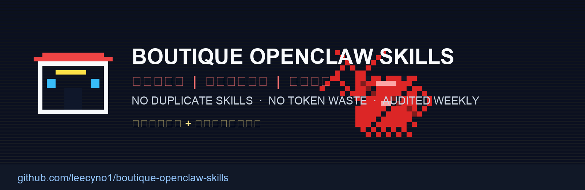
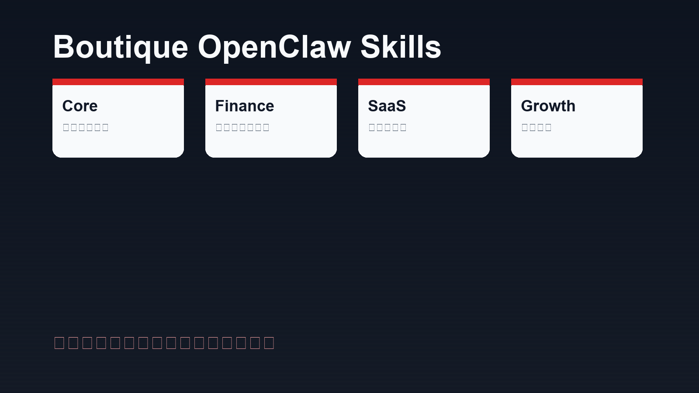
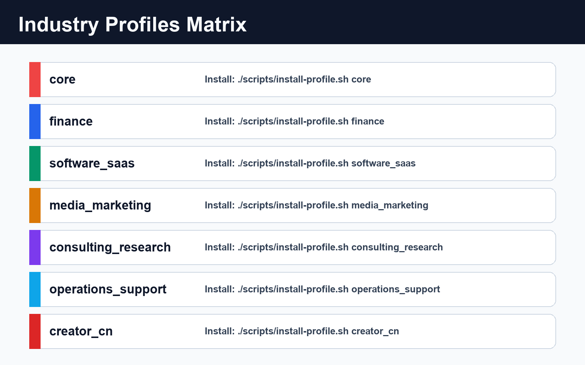

# boutique-openclaw-skills





## 仓库参数（Repository Parameters）

| 参数 | 值 |
|---|---|
| Curation 模式 | One Capability = One Skill |
| 精选能力数 | 42 |
| 行业档数量 | 7 |
| 更新策略 | 每周上游同步（可手动触发） |
| 审计策略 | 更新后本地审计（风险/依赖/冲突） |
| 打包格式 | `dist/*.tar.gz` |
| 目标 | 降低 token 浪费，减少技能冲突，提升稳定性 |

## 快捷导航（Quick Navigation）

- [快速开始](#2-快速开始)
- [行业档（Profiles）](#3-行业档profiles)
- [更新与审计机制](#5-更新与审计机制)
- [安全与质量原则](#6-安全与质量原则)
- [打包发布](#7-打包发布)
- [设计说明](#8-设计说明)
- [Skills 全量目录](#10-skills-全量目录按分类可点击跳转原项目)
- [精选策略文档](docs/CURATION_POLICY.md)
- [更新与审计SOP](docs/UPDATE_AND_AUDIT.md)
- [行业映射说明](docs/INDUSTRY_MAP.md)

**精选店模式（Boutique Mode）** 的 OpenClaw skills 集合：

- 每个功能只精选 1 个 skill（不重复、不混装）
- 面向稳定生产，不追求“装得多”
- 定期上游更新 + 本地安全审计
- 按行业提供可直接安装的配置档（profiles）

> 核心目标：降低 token 浪费、减少工具冲突、避免版本混乱。

---

## 1) 为什么做这个项目

在大量 skills 混装场景中，常见问题包括：

1. 能力重复：同一功能有多个 skill，导致 agent 选错工具。
2. Token 浪费：重复工具都被检索/评估，推理链变长。
3. 版本混乱：更新后行为漂移，定位问题成本高。
4. 安全不可控：第三方 skill 更新后引入风险不易感知。

**Boutique 模式**通过“一功能一技能”把这些问题压到最低。

---

## 2) 快速开始

### 前置

- 已安装 OpenClaw
- 已安装 ClawHub CLI：

```bash
npm i -g clawhub
```

### 查看可用行业档

```bash
./scripts/list-profiles.sh
```

### 安装某个行业档（示例：core）

```bash
./scripts/install-profile.sh core
```

### 仅预览安装命令

```bash
./scripts/install-profile.sh finance --dry-run
```

---

## 3) 行业档（Profiles）

- `core`：通用必装基线
- `finance`：金融研究与报告
- `software_saas`：工程研发与运维
- `media_marketing`：内容营销与增长
- `consulting_research`：咨询研究与交付
- `operations_support`：运营支持与任务闭环
- `creator_cn`：中文创作者工作流（含 Baoyu 扩展）

详见：[`docs/INDUSTRY_MAP.md`](docs/INDUSTRY_MAP.md)

---

## 4) 目录结构

```text
boutique-openclaw-skills/
├─ catalog/             # 唯一能力映射（one capability -> one skill）
├─ profiles/            # 行业安装档
├─ scripts/             # 安装、同步、审计、打包脚本
├─ docs/                # 规范、运维与说明
├─ assets/              # logo 与配图
├─ reports/             # 审计与更新报告输出
└─ .github/workflows/   # 定时更新 + 审计流水线
```

---

## 5) 更新与审计机制

### 手动执行

```bash
./scripts/sync-upstream.sh
```

该命令会：
1. 逐个执行 `clawhub update <skill>`
2. 运行本地审计 `scripts/audit_skills.py`
3. 输出报告到 `reports/`

### 定时执行

GitHub Actions: `.github/workflows/sync-audit.yml`

- 每周自动更新与审计
- 可手动触发
- 自动上传报告产物

详见：[`docs/UPDATE_AND_AUDIT.md`](docs/UPDATE_AND_AUDIT.md)

---

## 6) 安全与质量原则

- 一功能一技能（禁止重复能力）
- 每个 skill 必须标注风险等级与依赖
- 高风险命令模式（例如 `curl|sh`, `rm -rf /`, `sudo`）自动审计
- 更新后必须有审计记录，才允许发布 bundle

详见：[`docs/CURATION_POLICY.md`](docs/CURATION_POLICY.md)

---

## 7) 打包发布

```bash
./scripts/build-bundle.sh
```

输出：`dist/boutique-openclaw-skills-<timestamp>.tar.gz`

---

## 8) 设计说明

项目 logo 与配图遵循「Boutique Reliability」视觉哲学：

- 低噪声、强结构、有限高亮
- 表达“精选而非堆叠”的产品价值

详见：[`docs/VISUAL_PHILOSOPHY.md`](docs/VISUAL_PHILOSOPHY.md)

---

## 9) License

[MIT](LICENSE)

---

## 10) Skills 全量目录（按分类，可点击跳转原项目）

> 所有条目均可点击跳转到对应项目页（ClawHub）。

### 自动化与能力进化（4）
- [`cron-wake`](https://clawhub.com/skills/cron-wake) - `scheduled_actions`
- [`proactive-agent`](https://clawhub.com/skills/proactive-agent) - `proactive_followups`
- [`self-improving-agent`](https://clawhub.com/skills/self-improving-agent) - `self_improvement`
- [`subagent`](https://clawhub.com/skills/subagent) - `multi_agent_dispatch`

### 开发/工程与运维（6）
- [`agent-browser`](https://clawhub.com/skills/agent-browser) - `browser_automation`
- [`chrome-devtools-mcp`](https://clawhub.com/skills/chrome-devtools-mcp) - `browser_debug`
- [`database`](https://clawhub.com/skills/database) - `database_ops`
- [`github`](https://clawhub.com/skills/github) - `github_ops`
- [`prisma-database-setup`](https://clawhub.com/skills/prisma-database-setup) - `prisma_bootstrap`
- [`shell`](https://clawhub.com/skills/shell) - `terminal_ops`

### 搜索/研究/情报（6）
- [`blogwatcher`](https://clawhub.com/skills/blogwatcher) - `blog_monitoring`
- [`brave-search`](https://clawhub.com/skills/brave-search) - `web_search`
- [`news-radar`](https://clawhub.com/skills/news-radar) - `news_intelligence`
- [`reddit`](https://clawhub.com/skills/reddit) - `community_intelligence`
- [`summarize`](https://clawhub.com/skills/summarize) - `content_summarization`
- [`url-to-markdown`](https://clawhub.com/skills/url-to-markdown) - `url_to_markdown`

### 内容/营销/增长（5）
- [`content-strategy`](https://clawhub.com/skills/content-strategy) - `content_strategy`
- [`domain-hunter`](https://clawhub.com/skills/domain-hunter) - `domain_research`
- [`marketing-psychology`](https://clawhub.com/skills/marketing-psychology) - `marketing_psychology`
- [`programmatic-seo`](https://clawhub.com/skills/programmatic-seo) - `programmatic_seo`
- [`social-content`](https://clawhub.com/skills/social-content) - `social_content`

### 设计/前端/UI（3）
- [`banner-creator`](https://clawhub.com/skills/banner-creator) - `banner_design`
- [`infographic-pro`](https://clawhub.com/skills/infographic-pro) - `infographic_design`
- [`logo-creator`](https://clawhub.com/skills/logo-creator) - `logo_design`

### 图像/音频/多媒体（4）
- [`ai-image-generation`](https://clawhub.com/skills/ai-image-generation) - `image_generation`
- [`openai-whisper`](https://clawhub.com/skills/openai-whisper) - `speech_to_text`
- [`tts`](https://clawhub.com/skills/tts) - `text_to_speech`
- [`video-frames`](https://clawhub.com/skills/video-frames) - `video_frame_extraction`

### 文档/办公（4）
- [`docx`](https://clawhub.com/skills/docx) - `docx_processing`
- [`pdf`](https://clawhub.com/skills/pdf) - `pdf_processing`
- [`pptx`](https://clawhub.com/skills/pptx) - `presentation_generation`
- [`xlsx`](https://clawhub.com/skills/xlsx) - `spreadsheet_processing`

### 个人效率/助手（4）
- [`apple-calendar`](https://clawhub.com/skills/apple-calendar) - `calendar_planning`
- [`apple-notes`](https://clawhub.com/skills/apple-notes) - `personal_notes`
- [`apple-reminders`](https://clawhub.com/skills/apple-reminders) - `task_reminders`
- [`weather`](https://clawhub.com/skills/weather) - `weather_lookup`

### 运营/观测（4）
- [`find-skills`](https://clawhub.com/skills/find-skills) - `skill_discovery`
- [`model-usage`](https://clawhub.com/skills/model-usage) - `cost_observability`
- [`session-logs`](https://clawhub.com/skills/session-logs) - `session_observability`
- [`skill-creator`](https://clawhub.com/skills/skill-creator) - `skill_authoring`

### 安全审计（1）
- [`skill-security-auditor`](https://clawhub.com/skills/skill-security-auditor) - `skill_security_review`

### 行业专项（金融）（1）
- [`finance-data`](https://clawhub.com/skills/finance-data) - `financial_data`
